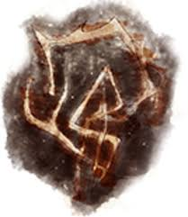

# Worldbuilding 
[Back](https://george479.github.io/Portfolio/)

## Progress 1/29 

---

### Intro

I will be making a world in which I will be able to add all of my created characters in a reasonable way. This will be the basis for both a dnd campaign I want to run and also a board game based on the characters as well.

---

#### Inspiration!

The idea and inspiration for my plan is going to be a world where multiple different beings from different worlds are taken to in order to basically fight it out. There will be two factions on this world to distinguish the "good" and "evil" from the player's POV as the the side that seems to be good.

The way to get these vastly different characters would be similar to Dead By Daylight where this powerful entity goes around just taking people into its realm. The two sides for my world will have their ways to convince people rather than just taking them.

---

[Board Game](https://docs.google.com/document/d/19Q8aqweCYfRFp5yDVOuF3UHxz8M7h0l8RrT4t6mSqeo/edit?usp=sharing)